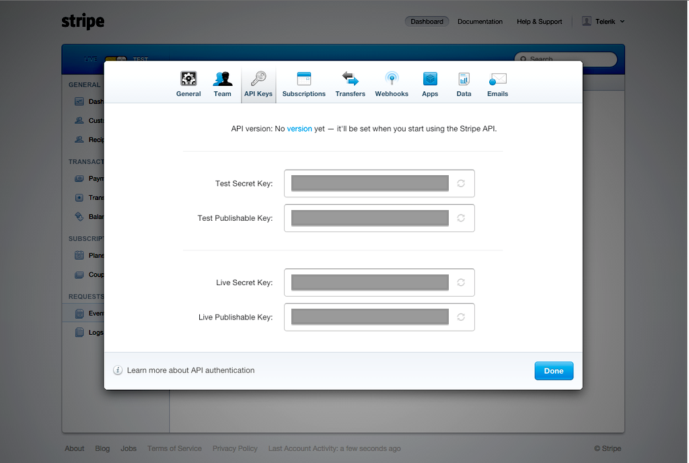
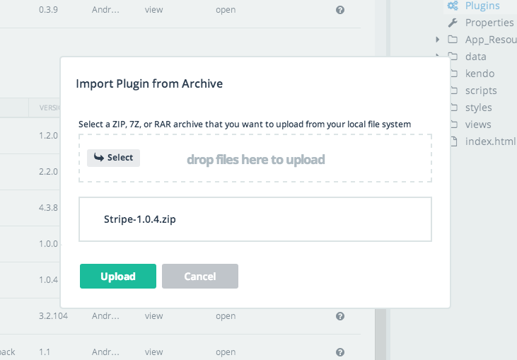
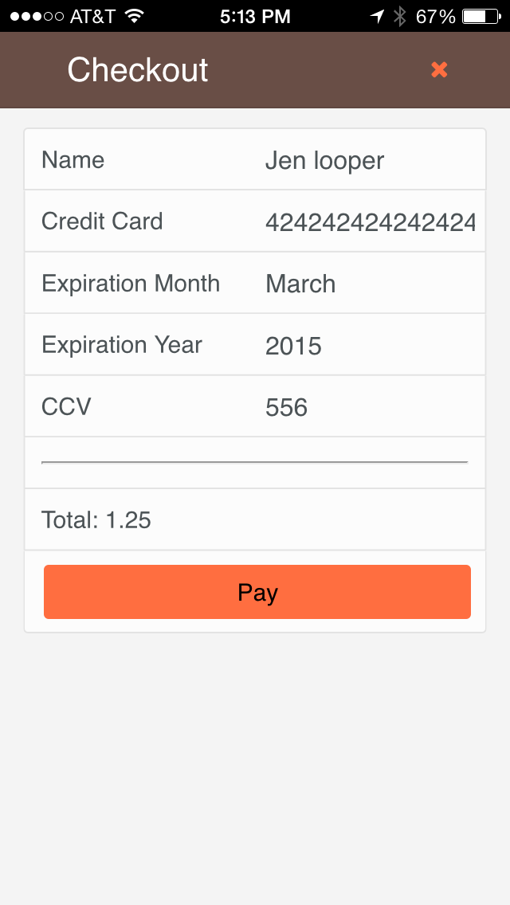
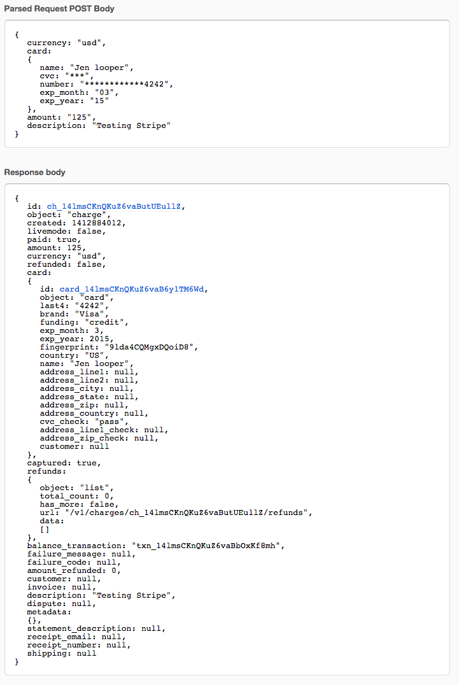

# Create a Great Checkout Experience for the Dineissimo App using the Stripe Plugin

One of the most important decisions in app development will be how to make money. In the case of Dineissimo, you have an app that is tailor-made to accept payments: a restaurant experience that allows users to add items to a shopping cart. Let’s complete the circle by integrating Telerik’s new Stripe plugin so that users can actually check out.

## Getting Started:

### Step 1: Sign Up for Stripe

Sign up for a Stripe account at [http://www.stripe.com](http://www.stripe.com). Stripe describes itself as a ‘suite of APIs that powers commerce for businesses of all sizes.’ Apps such as Lyft, TaskRabbit, Wufoo and Postmates have integrated Stripe to accept payments from their customers. It is known for its sleek shopping experience and inclusion of useful APIs for coupons, special deals, subscriptions, and recurring billing. For our purposes, we will use Stripe to allow customers to pay for menu items that they want to add to their restaurant experience. 

Once you sign up for an account, go to ‘Account Settings’ in the dashboard and locate your API Keys. Make a note of the ‘Test Secret Key’ for later.



##Step 2: Install the Stripe Plugin

Because we are going to need to alter the API Key in the Plugin code, we will install this plugin differently than the way we did it for the Social Share plugin.

1. First, Go to [http://plugins.telerik.com/plugin/stripe](http://plugins.telerik.com/plugin/stripe) and click ‘Download Plugin’.
2. Upload it to the AppBuilder in-browser client by right-clicking on the ‘plugin’ gear icon in the Project Navigator panel and selecting the zip file you just recompressed.



3. Edit the Stripe plugin’s plugin.xml file, adding your Test Secret Key. Expand the Plugins folder from the gear icon in the Project Navigator Panel and find the Stripe folder. Edit plugin.xml by removing the line:

```
<preference name="API_KEY" />
```
Look for the two places that reference <string>API_KEY</string> and replace API_KEY with your Test Secret Key and save plugin.xml.

##Step 3: Build out the checkout screens

The checkout process you’re going to build is the simplest possible screen—just the basic information needed by Stripe to charge a credit card. To test the Stripe API, use the values listed here [https://stripe.com/docs/testing](https://stripe.com/docs/testing), for example the fake credit card numbers. 

First, add a few styles to styles/cart.css to make the form look nice:

```
.cart-form {
    margin-top: 60px;
}
.cart-button {
    background-color: #ff6e40 !important;
    width: 100%;
}
```
Then, add the html markup to shopping-cart.html, replacing the text:

```
<h2>Not Implemented! By Design. Read on….</h2>
<p>There are literally 100’s of e-commerce checkout systems on the market today. That would be hard to put into a single, clean, template. Instead, we’ll be reaching out to you via email to provide you with tutorials on how to embed this functionality into your app.</p>
```

with this form:

```
<div class="cart-form">       
        <form id="cartForm" data-role="validator" novalidate="novalidate">
            <ul data-role="listview" data-style="inset">
                <li>
                    <label>Name
                        <input type="text" name="name" required="required" data-bind="value: name"/>
                    </label>
                </li>
                <li>
                    <label>Credit Card
                        <input type="text" name="cc" required="required" data-bind="value: cc"/>
                    </label>
                </li>
                <li>
                    <label>Expiration Month
                       
                        <select data-bind="value: expmonth">
                          <option value="01">January</option>
                          <option value="02">February</option>
                          <option value="03">March</option>
                          <option value="04">April</option>
                          <option value="05">May</option>
                          <option value="06">June</option>
                          <option value="07">July</option>
                          <option value="08">August</option>
                          <option value="09">September</option>
                          <option value="10">October</option>
                          <option value="11">November</option>
                          <option value="12">December</option>
                        </select>
                    </label>
                </li>
               
                <li>
                    <label>Expiration Year                       
                        <select data-bind="value: expyear">
                          <option value="14">2014</option>
                          <option value="15">2015</option>
                          <option value="16">2016</option>
                        </select>
                    </label>
                </li>
                <li>
                    <label>CCV
                        <input type="number" name="cvc" required="required" data-bind="value: cvc"/>
                    </label>
                </li>
               
                <li>
                    <hr/>
                </li>
               
                <li>
                    <label>Total: <span  data-bind="text: dataSource.aggregates().itemPrice.sum"></span></label>
                </li>
               
                <li>
                    <button type="button" data-role="button" class="cart-button" data-bind="click: pay">Pay</button>
                </li>

            </ul>
            
                              
        </form>
    </div>
```
This form will look like this in the end:



Finally, go to shopping-cart.js. We need to alter the definition of win.app.ShoppingCart:

```
win.app.ShoppingCart = kendo.observable({
```

This will make the functions ‘observable’ by the framework so that changes to the form values will be picked up and analyzed.

Lastly, add a function that will be triggered on button click:
```
pay: function (e) {
           
          
            if (!this.name) {
                navigator.notification.alert("Username is required.");
                return;
            }
            if (!this.cc) {
                navigator.notification.alert("Credit card number is required.");
                return;
            }
            if (!this.cvc) {
                navigator.notification.alert("CVC is required.");
                return;
            }
            if (!this.expmonth) {
                navigator.notification.alert("Expiration month is required.");
                return;
            }
            if (!this.expyear) {
                navigator.notification.alert("Expiration year is required.");
                return;
            }
           
            var validator = $("#cartForm").data("kendoValidator");
                  if (validator.validate()) {
                      kendo.mobile.application.showLoading();
                       stripe.charges.create({
/*ensure the amount aggregated in the datasource is a number, and multiply it by 100 as Stripe expects the sum to be in cents*/
                          amount : Number(e.data.dataSource.aggregates().itemPrice.sum)*100,
                //the type of currency, US Dollars for now
                          currency :  “usd”,
                          card : {
                              number : this.cc,
                              exp_month : this.expmonth,
                              exp_year : this.expyear,
                              cvc : this.cvc,
                              name : this.name
                            },
                        description : "Testing Stripe"                     
                  }, function(result){
                     
                      kendo.mobile.application.hideLoading();

                      if(result.error){
                          navigator.notification.alert(result.error.message);
                      }
                      else{
                          navigator.notification.alert("Thank you for your order!");
                      }
                                                                 
                  });
            
                  }
          
        }

```
This function asks Stripe to create a charge with the amount in your shopping cart (multiplied by 100, as Stripe expects payments in cents). Any errors reported by Stripe
appear in the notification, for example incorrect credit cards, amounts, or other problems. If your test charge goes through, however, on this sandbox account, you will see a ‘thank you'
alert and the charge will appear in your Stripe dashboard:



This is very exciting! Now you can accept credit cards for your restaurant. You’re really in business now.

# Ninja:

To extend this basic implementation, you could collect email addresses in your form and email a receipt to your customer.

You could create a confirmation screen and have the app navigate to that after the charge is completed. You could try to create a coupon and invite customers to use it…all this can be accomplished via the Stripe plugin or (for emails) on the Stripe dashboard. Have fun!


